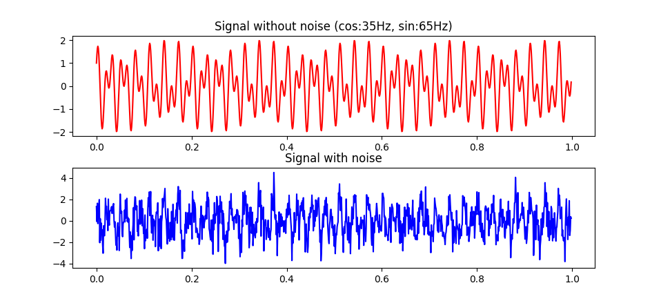
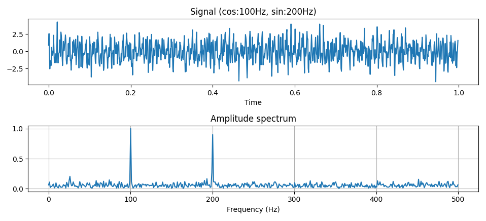

# Fast Fourier Transform With Python

## signal_generator.py
    timeVector, finalSignalWoNoise, finalSignal = signalGenerator(sampleRate, cosHz, sinHz)

---

## amplitude_generator.py
We use fast fourier transform in this example. \

